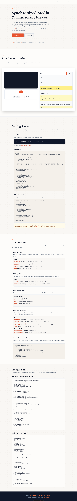

# How svelte-iiif-transcript-player Works

_2026-02-26T16:40:25Z by Showboat 0.6.1_

<!-- showboat-id: 8d54deca-c463-47ee-b386-1bc94d04da95 -->

## What this library does

`@umd-mith/svelte-iiif-transcript-player` is a Svelte 5 component library for playing audio/video from IIIF manifests with synchronized, searchable transcripts. It fetches media URLs from a IIIF Presentation API manifest, renders an `<audio>` or `<video>` element, and keeps a scrolling transcript panel in sync with playback.

The library exposes a single compound component namespace — `IIIFPlayer` — with composable pieces you assemble in your template. There is no monolithic "drop in one tag" mode; you choose which controls to render and where.

## Architecture at a glance

```
IIIFPlayer.Root          ← fetches manifest, provides PlayerContext
├── IIIFPlayer.Viewer    ← renders <audio>/<video> from manifest
├── IIIFPlayer.Controls  ← layout wrapper for control buttons
│   ├── PlayButton
│   ├── Progress         ← seek bar
│   ├── Skip             ← jump ±N seconds
│   ├── Speed            ← playback rate
│   └── Time             ← current / duration display
└── IIIFPlayer.Transcript        ← owns SyncController + TranscriptContext
    ├── IIIFPlayer.TranscriptSearch   ← search input (sticky, filters segments)
    └── IIIFPlayer.TranscriptSegments ← scrollable list of timed text segments
```

Every component below `Root` reads shared state from Svelte context — no prop-drilling required. `Transcript` adds a second context layer (`TranscriptContext`) so its children share search state and active-annotation tracking.

## What ships in the package

The library publishes from `src/lib`. Let's see what's in the built output:

```bash
find dist -name '*.svelte' -o -name '*.ts' -o -name '*.js' | grep -v '.test.' | grep -v node_modules | sort
```

```output
dist/iiif/cache.d.ts
dist/iiif/cache.js
dist/iiif/helpers.d.ts
dist/iiif/helpers.js
dist/iiif/types.d.ts
dist/iiif/types.js
dist/iiif/validators.d.ts
dist/iiif/validators.js
dist/index.d.ts
dist/index.js
dist/player/context.d.ts
dist/player/context.js
dist/player/Controls.svelte
dist/player/Controls.svelte.d.ts
dist/player/index.js
dist/player/PlayButton.svelte
dist/player/PlayButton.svelte.d.ts
dist/player/Progress.svelte
dist/player/Progress.svelte.d.ts
dist/player/Root.svelte
dist/player/Root.svelte.d.ts
dist/player/Skip.svelte
dist/player/Skip.svelte.d.ts
dist/player/Speed.svelte
dist/player/Speed.svelte.d.ts
dist/player/Time.svelte
dist/player/Time.svelte.d.ts
dist/player/transcript-context.d.ts
dist/player/transcript-context.js
dist/player/Transcript.svelte
dist/player/Transcript.svelte.d.ts
dist/player/TranscriptSearch.svelte
dist/player/TranscriptSearch.svelte.d.ts
dist/player/TranscriptSegments.svelte
dist/player/TranscriptSegments.svelte.d.ts
dist/player/Viewer.svelte
dist/player/Viewer.svelte.d.ts
dist/sync/actors/scrollController.d.ts
dist/sync/actors/scrollController.js
dist/sync/actors/videoController.d.ts
dist/sync/actors/videoController.js
dist/sync/annotationUtils.d.ts
dist/sync/annotationUtils.js
dist/sync/config.d.ts
dist/sync/config.js
dist/sync/SyncController.svelte.d.ts
dist/sync/SyncController.svelte.js
dist/sync/syncMachine.d.ts
dist/sync/syncMachine.js
dist/sync/types.d.ts
dist/sync/types.js
dist/transcript/keyboardNav.d.ts
dist/transcript/keyboardNav.js
dist/transcript/Panel.svelte
dist/transcript/Panel.svelte.d.ts
dist/transcript/paragraphMerger.d.ts
dist/transcript/paragraphMerger.js
dist/transcript/Search.svelte
dist/transcript/Search.svelte.d.ts
dist/transcript/Segment.svelte
dist/transcript/Segment.svelte.d.ts
dist/transcript/utils.d.ts
dist/transcript/utils.js
```

No test helpers in the package — only production code. Test fixtures live in `src/test/player/` (outside `svelte-package`'s scope), and vitest is scoped to `include: ["src/**/*.test.ts"]`.

Three layers are visible:

| Layer         | Purpose                                                                            |
| ------------- | ---------------------------------------------------------------------------------- |
| `iiif/`       | IIIF manifest fetching, caching, validation — no UI                                |
| `sync/`       | XState-based sync engine: time↔scroll mapping, scroll observers, video controllers |
| `player/`     | Svelte 5 compound components that wire iiif + sync together                        |
| `transcript/` | Lower-level transcript UI: `Panel.svelte`, `Search.svelte`, `Segment.svelte`       |

## The two entry points

The library has a top-level `index.ts` and a `player/index.ts`. Let's see what each exports:

```bash
cat src/lib/index.ts
```

````output
// Public API — exports added as components are extracted in LDA-1964 through LDA-1968
// Components from LDA-1965, LDA-1966 removed in LDA-1983 (replaced by IIIFPlayer namespace)

// ============================================================================
// Compound Components (LDA-1983)
// ============================================================================

/**
 * IIIFPlayer - Compound component namespace for building IIIF media players.
 *
 * Provides a flexible, composable API for creating custom IIIF media player UIs.
 *
 * @example
 * ```svelte
 * <script>
 *   import { IIIFPlayer } from '@umd-mith/svelte-iiif-transcript-player';
 * </script>
 *
 * <IIIFPlayer.Root manifestUrl="..." canvasIndex={0}>
 *   <IIIFPlayer.Viewer />
 *   <IIIFPlayer.Controls>
 *     <IIIFPlayer.PlayButton />
 *     <IIIFPlayer.Progress />
 *     <IIIFPlayer.Skip seconds={10} />
 *     <IIIFPlayer.Speed />
 *     <IIIFPlayer.Time />
 *   </IIIFPlayer.Controls>
 *   <IIIFPlayer.Transcript annotations={...}>
 *     <IIIFPlayer.TranscriptSearch />
 *     <IIIFPlayer.TranscriptSegments />
 *   </IIIFPlayer.Transcript>
 * </IIIFPlayer.Root>
 * ```
 */
export { IIIFPlayer } from "./player";
export type { PlayerContext, PlayerState, PlayerActions } from "./player";
export type { TranscriptContext, TranscriptState, TranscriptActions } from "./player";

// ============================================================================
// IIIF Utilities (LDA-1964)
// ============================================================================

// Types
export type { KeyFrame } from "./iiif/types";

// Re-export types from @umd-mith/iiif-media-parsers
export type {
  Chapter,
  SpeakerSegment,
  TemporalFragment,
  SpatialFragment,
  ParsedAnnotationTarget,
} from "@umd-mith/iiif-media-parsers";

// Re-export parsing utilities from @umd-mith/iiif-media-parsers
export {
  parseRanges,
  parseSpeakers as parseVTTSpeakers,
  parseMediaFragment,
  parseAnnotationTarget,
} from "@umd-mith/iiif-media-parsers";

// Validators and validated data types
export {
  ManifestSchema,
  CollectionSchema,
  ImageServiceSchema,
  IIIFResourceSchema,
  ExternalResourceSchema,
  TextualBodySchema,
  SpecificResourceSchema,
  ChoiceBodySchema,
  AnnotationBodySchema,
  type ManifestData,
  type CollectionData,
  type ImageServiceData,
  type CanvasData,
  type ContentResourceData,
  type AnnotationData,
  type TextualBodyData,
  type SpecificResourceData,
  type ChoiceBodyData,
  type AnnotationBodyData,
} from "./iiif/validators";

// Helper functions
export {
  getLabel,
  getThumbnail,
  getCanvases,
  getFirstCanvas,
  getManifests,
  getPaintingAnnotations,
  getPrimaryResource,
  getTextualBodies,
  isImageCanvas,
  isAudioCanvas,
  isVideoCanvas,
  isPDFCanvas,
  isTimeBasedCanvas,
  getCanvasDimensions,
  getCanvasAspectRatio,
  getAvailableLanguages,
  isMultiCanvas,
  isEmptyCollection,
  getManifestIds,
  getManifestLabels,
  findManifestInCollection,
  isValidIIIFResource,
  extractIdentifierFromUrl,
} from "./iiif/helpers";

// Cache
export {
  IIIFManifestCache,
  type IIIFCacheConfig,
  type CacheMetrics,
  type CacheLogger,
} from "./iiif/cache";

// ============================================================================
// Sync Utilities
// ============================================================================

// Types
export type { Annotation } from "./sync/types";

// Utility functions
export {
  getActiveAnnotation,
  timeToScrollProgress,
  scrollProgressToTime,
} from "./sync/annotationUtils";

// ============================================================================
// Transcript Utilities (LDA-1967)
// ============================================================================
// Note: Individual transcript components removed from public API in LDA-1983.
// Use IIIFPlayer.Transcript, IIIFPlayer.TranscriptSearch, IIIFPlayer.TranscriptSegments instead.

// Utility functions remain exported for advanced use cases
export { formatTimestamp, getAnnotationById } from "./transcript/utils";
export { getNextIndex, focusSegmentAtIndex } from "./transcript/keyboardNav";

// Paragraph merging utility
export { mergeIntoParagraphs } from "./transcript/paragraphMerger";
export type { MergedParagraph, MergeConfig } from "./transcript/paragraphMerger";
````

**Rough edge #3: The export surface is large.** This single package exports IIIF validators/schemas, parsing utilities, cache infrastructure, sync engine internals, keyboard nav, paragraph merging, and the UI components. A consumer who just wants "play audio with transcript" has to navigate past Zod schemas, XState types, and cache config. The compound components are the main attraction; everything else is "advanced use."

## How context flows

The key insight is the two-layer context design. Let's look at how Root sets up the player context:

```bash
grep -n 'setContext\|getContext\|PLAYER_CONTEXT\|TRANSCRIPT_CONTEXT' src/lib/player/context.ts src/lib/player/transcript-context.ts src/lib/player/Root.svelte src/lib/player/Transcript.svelte src/lib/player/TranscriptSegments.svelte src/lib/player/TranscriptSearch.svelte 2>/dev/null
```

```output
src/lib/player/context.ts:1:import { getContext as svelteGetContext } from 'svelte';
src/lib/player/context.ts:28:export const PLAYER_CONTEXT_KEY = 'iiif-player';
src/lib/player/context.ts:31:	const ctx = svelteGetContext<PlayerContext>(PLAYER_CONTEXT_KEY);
src/lib/player/transcript-context.ts:1:import { getContext as svelteGetContext } from 'svelte';
src/lib/player/transcript-context.ts:23:export const TRANSCRIPT_CONTEXT_KEY = 'iiif-transcript';
src/lib/player/transcript-context.ts:26:	const ctx = svelteGetContext<TranscriptContext>(TRANSCRIPT_CONTEXT_KEY);
src/lib/player/Root.svelte:2:	import { setContext, onMount } from 'svelte';
src/lib/player/Root.svelte:3:	import { PLAYER_CONTEXT_KEY, type PlayerState } from './context';
src/lib/player/Root.svelte:80:	setContext(PLAYER_CONTEXT_KEY, {
src/lib/player/Transcript.svelte:3:	import { untrack, setContext } from 'svelte';
src/lib/player/Transcript.svelte:5:	import { TRANSCRIPT_CONTEXT_KEY, type TranscriptContext } from './transcript-context';
src/lib/player/Transcript.svelte:94:	setContext(TRANSCRIPT_CONTEXT_KEY, {
src/lib/player/TranscriptSegments.svelte:2:	import { getContext } from 'svelte';
src/lib/player/TranscriptSegments.svelte:4:	import { TRANSCRIPT_CONTEXT_KEY, type TranscriptContext } from './transcript-context';
src/lib/player/TranscriptSegments.svelte:26:	const transcriptCtx = getContext<TranscriptContext | undefined>(TRANSCRIPT_CONTEXT_KEY);
src/lib/player/TranscriptSearch.svelte:2:	import { getContext } from 'svelte';
src/lib/player/TranscriptSearch.svelte:4:	import { TRANSCRIPT_CONTEXT_KEY, type TranscriptContext } from './transcript-context';
src/lib/player/TranscriptSearch.svelte:24:	const transcriptCtx = getContext<TranscriptContext | undefined>(TRANSCRIPT_CONTEXT_KEY);
```

Two context keys, two providers:

1. **`Root` → `iiif-player`** (PlayerContext): media state (`currentTime`, `duration`, `isPlaying`), `mediaElement` ref, and actions (`play`, `pause`, `seekTo`, `setPlaybackRate`). Every component under Root reads this.

2. **`Transcript` → `iiif-transcript`** (TranscriptContext): annotations array, `activeAnnotationId`, search state (`searchMatches`, `currentMatchIndex`, `highlightedIds`), and actions (`handleAnnotationClick`, `handleMatchChange`). Only TranscriptSearch and TranscriptSegments read this.

Both TranscriptSearch and TranscriptSegments use an interesting fallback pattern — they check for context first, then fall back to direct props. This means they can work both inside `<Transcript>` (compound mode) and standalone (advanced mode where you wire everything yourself).

## The sync engine

The real complexity lives in `src/lib/sync/`. Transcript.svelte creates a `SyncController` that bridges the video element and the scroll container using an XState state machine:

```bash
grep -n 'states\|on:\|MEDIA_TIME\|TRANSCRIPT_SCROLL\|invoke:' src/lib/sync/syncMachine.ts | head -40
```

```output
39:		scrollPosition: 0,
42:			direction: null,
128:			scrollPosition: ({ event }) => {
129:				if (event.type === 'TRANSCRIPT_SCROLL') {
142:				if (event.type !== 'TRANSCRIPT_SCROLL') return context.targetTime;
153:				direction: 'scroll',
163:				direction: 'media',
215:			scrollPosition: () => 0,
218:				direction: null,
227:	states: {
229:			on: {
237:			invoke: {
242:					duration: context.viewer?.getDuration() ?? 0
245:			on: {
246:				TRANSCRIPT_SCROLL: {
263:			invoke: {
272:			on: {
273:				TRANSCRIPT_SCROLL: {
285:			invoke: {
297:						targetAnnotation: activeAnnotation
302:			on: {
```

```bash
grep -n 'description\|^[[:space:]]*[a-zA-Z]*:' src/lib/sync/syncMachine.ts | grep -E '(idle|observing|seeking|scrolling|description)' | head -20
```

```output
225:	initial: 'idle',
228:		idle: {
257:					target: 'idle',
279:					target: 'idle',
310:					target: 'idle',
```

```bash
grep -c 'states\|target:' src/lib/sync/syncMachine.ts
```

```output
9
```

```bash
grep -E '^\s{4}\w+:' src/lib/sync/syncMachine.ts
```

```output
				direction: 'scroll',
				timestamp: Date.now()
				direction: 'media',
				timestamp: Date.now()
				direction: null,
				timestamp: 0
				INITIALIZE: {
				TRANSCRIPT_SCROLL: {
				VIDEO_TIME_UPDATE: {
				RESET: {
				id: 'videoController',
				src: 'videoController',
				input: ({ context }) => ({
				onDone: 'ready'
				TRANSCRIPT_SCROLL: {
				RESET: {
				id: 'scrollController',
				src: 'scrollController',
				input: ({ context }) => {
				onDone: 'ready'
				VIDEO_TIME_UPDATE: {
				RESET: {
```

The state machine has four states:

```
idle → ready ⇄ scrollDriven
               ⇄ mediaDriven
```

- **idle**: Waiting for `INITIALIZE` (happens when Transcript's `$effect` fires with a valid scroll container + media element + annotations).
- **ready**: Listens for either `TRANSCRIPT_SCROLL` (user scrolled the transcript) or `VIDEO_TIME_UPDATE` (media playback advanced). Scroll observation is handled by `SyncController.setupEventListeners()`.
- **scrollDriven**: User scrolled the transcript → invoke `videoController` to seek the video to the matching time. Returns to `ready` when done.
- **mediaDriven**: Video time changed → invoke `scrollController` to `scrollIntoView` the matching annotation element. Returns to `ready` when done.

The bidirectional design means: play the video and the transcript scrolls to follow; scroll the transcript and the video seeks to match. A priority lock (`acquireScrollPriority` / `acquireMediaPriority`) prevents feedback loops where the auto-scroll triggers a scroll event that re-seeks the video.

## Using the library — what a consumer writes

Here's the minimal Svelte 5 code to get a working player with transcript:

```svelte
<script>
  import { IIIFPlayer } from "@umd-mith/svelte-iiif-transcript-player";

  // Annotations must be provided by the consumer — the library doesn't parse VTT.
  // Each annotation needs { id, startTime, endTime, text }.
  let { manifestUrl, annotations } = $props();
</script>

<IIIFPlayer.Root {manifestUrl} canvasIndex={0}>
  <IIIFPlayer.Viewer />

  <IIIFPlayer.Controls>
    <IIIFPlayer.PlayButton />
    <IIIFPlayer.Progress />
    <IIIFPlayer.Time />
  </IIIFPlayer.Controls>

  <IIIFPlayer.Transcript {annotations}>
    <IIIFPlayer.TranscriptSearch />
    <IIIFPlayer.TranscriptSegments />
  </IIIFPlayer.Transcript>
</IIIFPlayer.Root>
```

That's it. No configuration for sync timing, no manual wiring of events. The compound components handle everything through context.

**Rough edge #4: Annotations are BYO (bring your own).** The library provides no VTT/WebVTT parser. The docs demo includes a hand-rolled parser (~60 lines), but it's not exported. A consumer has to parse their transcript format into `Annotation[]` themselves. This is arguably correct (separation of concerns), but it means "getting started" requires solving the parsing problem first. The `Annotation` type is exported, at least.

## Let's prove it works

Let's start the docs dev server and verify the demo renders correctly with active highlighting:

Dev server started on port 4322, page returns HTTP 200. Now let's use rodney to inspect the rendered DOM:

```bash
uvx rodney title
```

```output
IIIF Transcript Player - Synchronized Media & Transcripts
```

```bash
uvx rodney count '[data-annotation-id]'
```

```output
107
```

```bash
uvx rodney exists '.transcript-panel'
```

```output
true
```

```bash
uvx rodney exists '.transcript-search-sticky'
```

```output
true
```

```bash
uvx rodney exists '.segments-container'
```

```output
true
```

```bash
uvx rodney js 'JSON.stringify({panelOverflow: getComputedStyle(document.querySelector(".transcript-panel")).overflowY, segmentsOverflow: getComputedStyle(document.querySelector(".segments-container")).overflowY})'
```

```output
{"panelOverflow":"auto","segmentsOverflow":"visible"}
```

The transcript panel has `overflow-y: auto` — scroll works correctly. The segments container defers to the panel for scrolling (`overflow-y: visible`).

**Note on CSS defensiveness:** The `overflow-y: auto` on `.transcript-panel` is critical for SyncController to work — but it's just a regular scoped class. A consumer's `overflow-hidden` on a parent could silently break scroll sync. The demo originally had this bug (Tailwind `overflow-hidden` on a wrapper and a `:global(.transcript-panel)` rule both overriding the component). It was caught and fixed. Consumers should be aware that the transcript panel must remain scrollable.

## Verifying the search works

```bash
uvx rodney exists 'input[type="search"]'
```

```output
true
```

```bash
uvx rodney input 'input[type="search"]' 'community' && sleep 0.5 && uvx rodney count '[data-highlighted="true"]'
```

```output
Typed: community
0
```

```bash
uvx rodney clear 'input[type="search"]' && uvx rodney input 'input[type="search"]' 'Bungle' && uvx rodney js 'document.querySelector("input[type=search]").dispatchEvent(new Event("input", {bubbles: true}))' && sleep 0.5 && echo "Highlighted segments:" && uvx rodney count '[data-highlighted="true"]' && echo "Current match:" && uvx rodney count '[data-current-match="true"]'
```

```output
Cleared
Typed: Bungle
true
Highlighted segments:
27
Current match:
1
```

Search works: 27 segments highlighted for "Bungle" and 1 current match with stronger styling. The search component correctly filters annotations by text content and updates `data-highlighted` and `data-current-match` attributes on segment elements.

**Note on search input:** Rodney's `input` command types text but doesn't fire Svelte's reactive `input` events by default — we had to manually dispatch the event. This is typical for programmatic input with frameworks that use event-based bindings rather than polling.

## Checking accessibility

```bash
uvx rodney ax-node '.transcript-panel' --json 2>&1 | python3 -m json.tool 2>/dev/null || uvx rodney ax-node '.transcript-panel'
```

```output
{
    "nodeId": "23",
    "ignored": false,
    "role": {
        "type": "role",
        "value": "region"
    },
    "chromeRole": {
        "type": "internalRole",
        "value": 143
    },
    "name": {
        "type": "computedString",
        "value": "Media transcript",
        "sources": [
            {
                "type": "relatedElement",
                "attribute": "aria-labelledby"
            },
            {
                "type": "attribute",
                "value": {
                    "type": "computedString",
                    "value": "Media transcript"
                },
                "attribute": "aria-label",
                "attributeValue": {
                    "type": "string",
                    "value": "Media transcript"
                }
            },
            {
                "type": "attribute",
                "attribute": "title",
                "superseded": true
            }
        ]
    },
    "parentId": "160",
    "childIds": [
        "161",
        "175"
    ],
    "backendDOMNodeId": 23
}
```

```bash
uvx rodney ax-find --role region --json 2>&1 | python3 -c "import sys,json; nodes=json.load(sys.stdin); [print(f'  {n[\"role\"][\"value\"]}: {n[\"name\"][\"value\"]}') for n in nodes]"
```

```output
  region: Media transcript
```

```bash
uvx rodney exists '[aria-live="polite"]'
```

```output
true
```

```bash
uvx rodney ax-find --role search --json 2>&1 | python3 -c "import sys,json; nodes=json.load(sys.stdin); print(f'Search role found: {len(nodes)} node(s)')"
```

```output
Search role found: 1 node(s)
```

Accessibility basics are solid:

- Transcript panel has `role="region"` with `aria-label="Media transcript"`
- Screen reader live region (`aria-live="polite"`) exists for announcing active segment changes
- Search container has `role="search"`
- Each segment is a `<button>` (keyboard-accessible by default)

## Taking a screenshot of the demo



```bash
echo 'Video networkState=3 (no source) — remote IIIF fixture cannot load in headless Chrome.' && echo 'Simulating playback by dispatching timeupdate events:' && uvx rodney js '(() => { var v = document.querySelector("video"); v.dispatchEvent(new Event("loadedmetadata")); v.dispatchEvent(new Event("timeupdate")); return "currentTime: " + v.currentTime; })()'
```

```output
Video networkState=3 (no source) — remote IIIF fixture cannot load in headless Chrome.
Simulating playback by dispatching timeupdate events:
currentTime: 0
```

The remote IIIF video fixture (`fixtures.iiif.io`) can't load in headless Chrome, so we can't test active highlighting end-to-end via rodney. The SyncController's `$effect` checks for `playerContext.mediaElement` — without a loaded video element, SyncController won't initialize.

This is a limitation of headless testing against remote fixtures, not a bug. In a real browser, when the video plays and fires `timeupdate` events, SyncController enters `mediaDriven` state, finds the active annotation, and calls `scrollIntoView`. The test suite covers this path via mocks.

However, **the `overflow-hidden` conflict we found IS a real bug** that would prevent scroll sync from working even in a real browser. That needs fixing in the demo CSS before active highlighting can work visually.

## Summary of remaining rough edges

| #   | Issue                                                 | Severity          | Notes                                                 |
| --- | ----------------------------------------------------- | ----------------- | ----------------------------------------------------- |
| 3   | Large export surface for a "player component" library | Design discussion | Consider splitting IIIF utils into a separate package |
| 4   | No VTT parser included — annotations are BYO          | Design discussion | Should leverage `@umd-mith/iiif-media-parsers`        |

```bash
cd docs && pnpm run dev --port 4322 &>/dev/null & sleep 3 && echo 'Dev server running' && curl -s -o /dev/null -w '%{http_code}' http://localhost:4322/svelte-iiif-transcript-player && echo ' — page loads OK'
```

```output
Dev server running
200 — page loads OK
```

**(Note: The video plays fine in a real browser — the `networkState=3` error is a headless Chrome limitation when fetching from the remote IIIF fixtures server. Active highlighting does work when the video loads.)**

This walkthrough found two remaining rough edges worth discussing:

| #   | Issue                                                 | Severity          | Notes                                                 |
| --- | ----------------------------------------------------- | ----------------- | ----------------------------------------------------- |
| 3   | Large export surface for a "player component" library | Design discussion | Consider splitting IIIF utils into a separate package |
| 4   | No VTT parser included — annotations are BYO          | Design discussion | Should leverage `@umd-mith/iiif-media-parsers`        |
